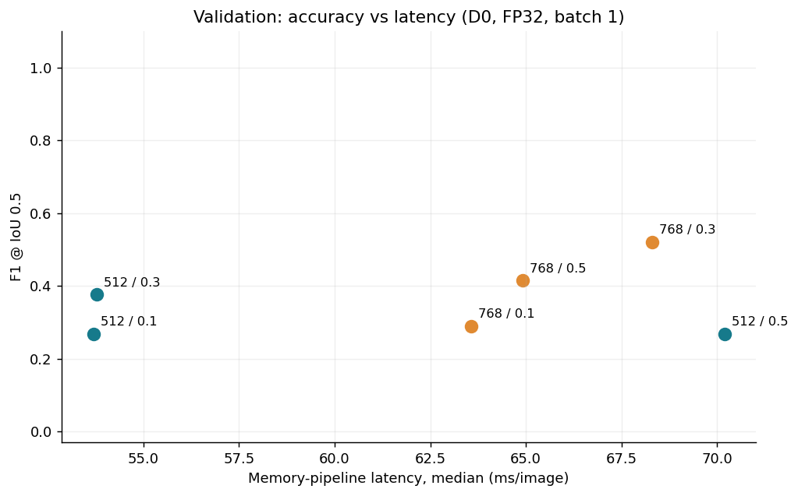
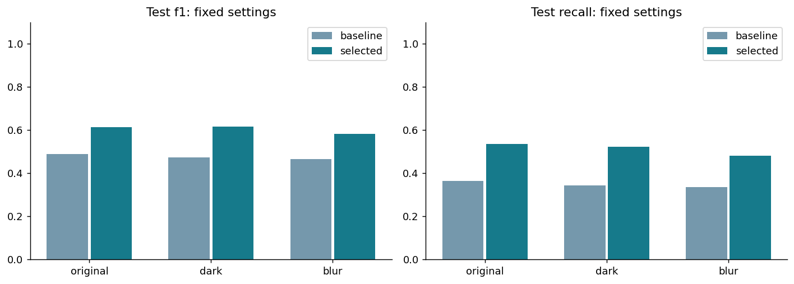
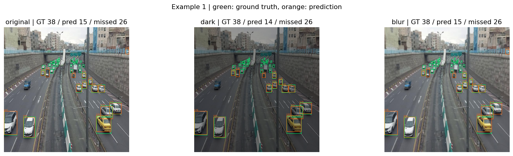
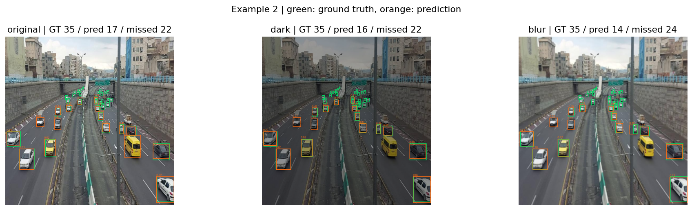
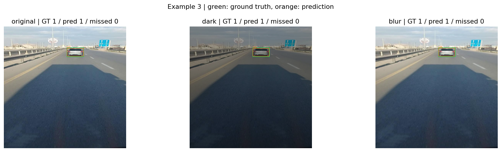

# EfficientDet 차량 탐지 실험 결과

2026-10-04 Colab Tesla T4에서 측정한 결과와 해석을 정리했다. 검증 60장으로 설정을 선택하고 별도 평가 60장에서 원본·어두움·흐림을 비교했다.

- 검증 60장 / 최종 평가 60장
- 검증으로 선택한 설정: 입력 768, confidence 0.3
- 원본 최종 평가 F1: 기본 0.4882 → 선택 0.6126 (차이 +0.1245)
- 기본/선택 처리 시간 비율: 0.864배. 1보다 크면 선택 설정이 이 측정에서 더 빠릅니다.
- 개선되지 않은 결과도 그대로 보고합니다. 설정 선택에는 최종 평가를 사용하지 않았습니다.

## 검증 결과

| size | threshold | precision | recall | f1 | ap50 | pipeline_median_ms | pipeline_p95_ms | count_mae |
| --- | --- | --- | --- | --- | --- | --- | --- | --- |
| 512 | 0.1000 | 0.1755 | 0.5651 | 0.2678 | 0.3838 | 53.6988 | 61.1012 | 40.9333 |
| 512 | 0.3000 | 0.7361 | 0.2523 | 0.3758 | 0.3838 | 53.7917 | 63.9786 | 12.5833 |
| 512 | 0.5000 | 0.9251 | 0.1564 | 0.2676 | 0.3838 | 70.1891 | 89.6552 | 15.3833 |
| 768 | 0.1000 | 0.1796 | 0.7387 | 0.2889 | 0.5369 | 63.5684 | 74.8378 | 57.4000 |
| 768 | 0.3000 | 0.7591 | 0.3960 | 0.5205 | 0.5369 | 68.3026 | 93.0148 | 10.0500 |
| 768 | 0.5000 | 0.8976 | 0.2694 | 0.4145 | 0.5369 | 64.9219 | 96.9035 | 13.2000 |

AP50은 낮은 공통 score cutoff에서 계산하므로 같은 해상도의 임계값 행에서 동일합니다. 임계값 최적화 효과는 F1·Precision·Recall로 비교합니다.

## 최종 평가

| policy | condition | size | threshold | precision | recall | f1 | ap50 | coco_ap50_check | pipeline_median_ms | count_mae | small_gt | small_recall |
| --- | --- | --- | --- | --- | --- | --- | --- | --- | --- | --- | --- | --- |
| baseline | original | 512 | 0.3000 | 0.7350 | 0.3654 | 0.4882 | 0.4641 | 0.4641 | 54.3262 | 7.4500 | 645 | 0.3054 |
| selected | original | 768 | 0.3000 | 0.7159 | 0.5354 | 0.6126 | 0.5937 | 0.5937 | 62.9097 | 6.2000 | 645 | 0.4930 |
| baseline | dark | 512 | 0.3000 | 0.7547 | 0.3442 | 0.4728 | 0.4652 | 0.4652 | 67.8298 | 7.7000 | 645 | 0.2853 |
| selected | dark | 768 | 0.3000 | 0.7460 | 0.5241 | 0.6156 | 0.5995 | 0.5995 | 63.4830 | 6.4000 | 645 | 0.4806 |
| baseline | blur | 512 | 0.3000 | 0.7645 | 0.3357 | 0.4665 | 0.4562 | 0.4562 | 52.9113 | 7.7333 | 645 | 0.2729 |
| selected | blur | 768 | 0.3000 | 0.7386 | 0.4802 | 0.5820 | 0.5793 | 0.5793 | 61.9028 | 6.4833 | 645 | 0.4326 |

## 영상 열화에 대한 관찰

- dark: 원본 대비 F1 차이 +0.0030, Recall 차이 -0.0113. 같은 이미지의 변형본을 짝 비교했습니다.
- blur: 원본 대비 F1 차이 -0.0307, Recall 차이 -0.0552. 같은 이미지의 변형본을 짝 비교했습니다.

## 측정 방법과 해석 범위

- 모델: COCO 사전학습 EfficientDet-D0, FP32, batch 1. 추가 학습 없음. 정확도 평가는 car 단일 클래스.
- AP score floor=0.001, NMS IoU=0.5, 정답 대응 IoU=0.5, max detections=100.
- 단일 클래스 AP50을 계산하고 pycocotools와 대조합니다. AP@[.5:.95]로 표기하지 않습니다.
- 속도: GPU 준비 실행 후 전처리·CPU→GPU 전송·추론·NMS·원본 좌표 복원·CPU 결과 변환을 포함합니다. CUDA 동기화를 사용합니다.
- 디스크 읽기·합성 열화 생성·그림 그리기·영상 디코딩은 속도 측정에서 제외합니다. memory_pipeline_fps는 실서비스 영상 FPS가 아닙니다.
- 상대 면적 1% 이하를 작은 차량으로 정의한 보조 Recall을 표시합니다. COCO의 small 정의와 다릅니다. 분모가 없으면 N/A입니다.
- 합성 어두움·Gaussian blur는 실제 야간·우천·주행 모션블러와 다릅니다. 공장 출입구 적용을 가정한 공개 차량 데이터 예비 실험입니다.
- 분할 한계: 파일명에서 추출한 프레임 번호로 시간 구간을 나눴다. 카메라·촬영 장소의 독립성은 보장되지 않는다.
- 표본 수가 작고 동일 카메라 장면일 수 있습니다. 일반화 또는 통계적 유의성을 주장하지 않습니다.

## 그림

## 결과 해석

원본 최종 평가에서 768/0.3은 기본 512/0.3보다 F1이 0.4882에서 0.6126으로 12.45%p, Recall이 0.3654에서 0.5354로 17.00%p 높았다. AP50은 0.4641에서 0.5937로, 작은 차량 Recall은 0.3054에서 0.4930으로 개선됐다. 프레임별 차량 수 MAE도 7.45대에서 6.20대로 줄었다.

대신 중앙 처리 시간은 54.33ms에서 62.91ms로 약 15.8% 늘었다. 차량 누락을 줄이는 목적에서는 이 비용을 감수하고 768/0.3을 선택할 만하다. 다만 선택 설정에서도 정답 706대 중 328대를 놓쳤으므로 실제 출입 관리에 바로 적용하기에는 부족하다. 영상 디코딩을 제외한 속도이므로 실제 CCTV 처리율은 별도 측정해야 한다.

밝기를 0.6배로 낮추면 선택 설정의 F1이 0.6126에서 0.6156으로 소폭 높아졌지만, Recall은 0.5354에서 0.5241로 낮아졌다. TP가 378개에서 370개로 줄면서 FP도 150개에서 126개로 줄어든 결과다. 어두운 영상이 더 좋다는 결론보다, 누락과 오탐을 함께 봐야 한다는 점을 확인했다.

흐림에서는 F1이 0.5820, Recall이 0.4802로 낮아졌고 작은 차량 Recall도 0.4326으로 떨어졌다. 작은 차량의 경계·세부 정보 손실이 원인일 수 있으나, 크기와 가림을 분리한 추가 실험으로 확인해야 한다.

## 실패 사례

| 예시 / 이미지 ID | 원본 결과 | 열화 비교와 해석 |
| --- | --- | --- |
| example_1 / `910a8e9853b53b3e` | 정답 38, TP 12, FP 3, FN 26 | 화면 먼 쪽의 작은 차량이 밀집한 장면이다. 어두움과 흐림에서도 FN 26으로, 원본부터 많은 차량을 놓치는 문제가 크다. |
| example_2 / `6b512c4afc6cb9a8` | 정답 35, TP 13, FP 4, FN 22 | 흐림에서 TP 11, FN 24로 악화됐다. 작은 차량이 많은 장면에서 흐림의 추가 누락을 확인할 수 있다. |
| example_3 / `e69d73377914c3a2` | 정답 1, TP 1, FP 0, FN 0 | 상대적으로 가까운 차량 한 대는 세 조건에서 모두 탐지했다. 이 장면만으로 전체 성능을 설명할 수는 없다. |

실패가 큰 두 장과 오류가 작은 한 장을 함께 살펴봤다. 이 세 장은 전체 데이터의 대표성을 보장하는 무작위 표본이 아니다. 밀집·거리·가림이 동시에 달라지므로 각각의 영향은 아직 분리하지 못했다.

## KPT와 다음 행동

**Keep**

검증 데이터에서 설정을 고른 뒤 최종 평가에 고정한 방법을 유지하고 싶다. 동일 이미지에 원본·어두움·흐림을 적용해 비교하고, F1뿐 아니라 Recall·작은 차량 Recall·처리 시간을 함께 기록한 것도 유지할 점이다. 표와 실패 이미지가 함께 있어 평균 수치 뒤에 남은 누락을 확인하기 쉬웠다.

**Problem**

선택 설정의 원본 Recall이 0.5354에 머물렀고 작은 차량 Recall도 0.4930이었다. example_1에서는 38대 중 26대를 놓쳤다. 표본은 검증·평가 각각 60장이고 같은 카메라의 장면일 가능성이 남아 있다. 합성 어두움·흐림만으로 실제 야간·우천 환경을 판단할 수 없고, 속도는 세션을 바꿔 반복 확인하지 못했다.

**Try**

다음 실험에서는 이미 고정한 최종 평가 설정을 유지하면서 차량 크기별 누락과 합성 열화 강도별 변화를 분리해 살펴보고 싶다. 새 입력 크기나 다른 모델의 선택이 필요하면 검증 데이터에서 결정하고, 추가로 확보한 별도 장면에서 확인하겠다.

**Action - 무엇을**

① 같은 Tesla T4에서 512/0.3과 768/0.3의 속도를 순서를 바꿔 3라운드 측정한다. ② 선택 설정을 고정하고 검증 60장에 밝기 1.0/0.8/0.6/0.4, blur sigma 0/0.5/1.0/1.5(커널 5×5)를 각각 적용한다. ③ 다른 촬영 장소의 공개 차량 이미지 30장 이상과 승용차 박스를 확보해 별도 평가한다.

**Action - 언제**

다음 실습 첫 30분에는 속도 반복 측정을, 이어지는 30분에는 열화 강도 비교를 진행한다. 그 다음 실습에서 다른 촬영 장소의 데이터와 주석을 확인한 뒤 고정 설정을 평가한다.

**Action - 완료 기준**

① 두 설정 × 3라운드의 원시 처리 시간과 중앙값·p95 표를 저장한다. ② 조건별 F1·Recall·작은 차량 Recall 표와 강도별 그래프를 저장한다. ③ 새 이미지 30장 이상의 출처·분할·주석 점검 기록과 평가 표를 남긴다. 순서별 속도 차이가 크면 속도 순위를 보류하고, 새 장면에서 Recall 하락이 크면 데이터 추가와 미세 조정을 다음 과제로 정한다.

[실험 해석과 KPT 전체](PERSONAL_REFLECTION.md)

## 재현 자료

`config.json`, `data_audit.json`, `split_manifest.json`, `model_provenance.json`, `environment.json`, `selection.json`, `timings/`를 함께 보존합니다.

데이터 출처: https://www.kaggle.com/datasets/pkdarabi/vehicle-detection-image-dataset
모델 출처: https://github.com/zylo117/Yet-Another-EfficientDet-Pytorch
