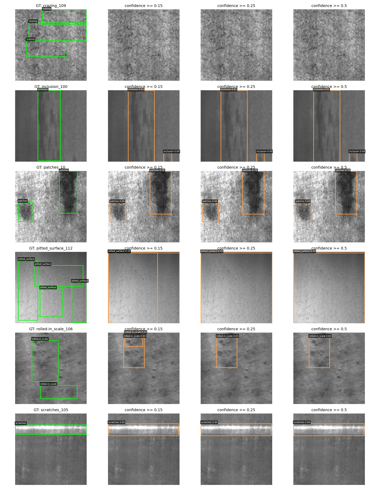

# YOLOv8 기반 제조 데이터 객체 탐지 실습

NEU-DET 철강 표면 이미지로 YOLOv8n을 학습하고, 6가지 결함의 종류와 위치를 탐지했다. confidence를 바꾸면서 미검출과 오검출이 어떻게 달라지는지도 비교했다.

## 실험 목표

YOLOv8으로 제조업의 결함 탐지를 할 수 있을지 궁금했다. 이번 실험에서는 모델의 confidence와 실제 정답을 비교하고, 어떤 결함을 잘 찾고 어떤 결함을 놓치는지 확인하고자 했다.

정답 박스가 있는 데이터를 이용한 지도학습 객체 탐지 실험이다. 정상 제품이나 처음 보는 결함을 구분하는 성능은 이번에 평가하지 않았다.

## 데이터 준비

NEU-DET는 200×200 크기의 이미지 1,800장으로 구성되어 있다. 결함 유형은 crazing, inclusion, patches, pitted_surface, rolled-in_scale, scratches이다.

- 픽셀은 같지만 정답 박스가 다른 `patches_101`, `patches_105` 두 장을 제외했다.
- `crazing_120`, `inclusion_62`, `patches_198`에 중복된 정답 박스가 있어 하나씩 제거했다.
- 여러 종류의 결함이 함께 있는 이미지 123장은 XML에 있는 모든 정답 박스를 사용했다.
- 정리한 1,798장을 파일명의 대표 결함 유형별로 약 70:15:15로 나눴다. seed는 42로 고정했다.

| 구분 | 이미지 수 | 정답 박스 수 |
|---|---:|---:|
| 학습 | 1,258 | 2,894 |
| 검증 | 269 | 665 |
| 시험 | 271 | 621 |

같은 이미지가 학습·검증·시험 데이터에 겹쳐 들어가지 않도록 픽셀의 SHA256 값을 비교했다. 픽셀이 완전히 같은 이미지만 확인한 것이므로 비슷한 이미지까지 모두 제거한 것은 아니다.

처음 학습할 때 중복 박스는 Ultralytics에서 자동으로 제거됐다. 이후 직접 계산하는 평가에서도 같은 정답 박스를 사용하도록 맞췄다. 학습 이미지와 유효한 라벨이 동일한지 확인한 뒤 기존 가중치로 재평가했다.

관련 기록: [데이터 점검](artifacts/annotation_audit.json), [분할 목록](artifacts/split_manifest.csv), [데이터 출처](artifacts/data_source.json).

## 학습 조건

| 항목 | 설정 |
|---|---|
| 모델 | COCO 사전학습 YOLOv8n |
| 실행 환경 | VS Code + Colab Tesla T4 |
| 입력 크기 | 320 |
| epochs / batch / seed | 20 / 16 / 42 |
| 학습 및 마지막 검증 시간 | 192.69초, 약 3.21분 |

증강 등 나머지 설정은 Ultralytics 기본값을 사용했다. 전체 설정은 `runs/yolov8n_e20_img320_seed42/args.yaml`에 있다. 학습 시간에는 데이터 다운로드와 문서 작성 시간이 포함되지 않는다.

## confidence 비교

검증 데이터에서 confidence 0.15, 0.25, 0.50을 비교했다. 예측과 정답의 클래스가 같고 IoU가 0.5 이상이면 맞힌 박스로 세었다. 하나의 정답을 여러 번 맞힌 것으로 세지 않도록 confidence가 높은 예측부터 한 번씩 연결했다. NMS IoU는 0.7로 고정했다.

| confidence | TP | FP | FN | Precision | Recall | F2 |
|---|---:|---:|---:|---:|---:|---:|
| **0.15** | 493 | 429 | 172 | 0.5347 | 0.7414 | **0.6882** |
| 0.25 | 436 | 229 | 229 | 0.6556 | 0.6556 | 0.6556 |
| 0.50 | 339 | 67 | 326 | 0.8350 | 0.5098 | 0.5528 |

confidence를 높이면 오검출은 줄었지만 놓치는 결함이 많아졌다. 이번에는 미검출을 줄이는 데 비중을 두고 F2가 가장 높은 0.15를 선택했다. F2는 Precision보다 Recall에 더 큰 비중을 주는 지표다. 시험 결과를 보고 confidence를 다시 고르지는 않았다.



## 시험 결과

| 지표 | 값 |
|---|---:|
| mAP50 | 0.7274 |
| mAP50–95 | 0.4137 |
| confidence | 0.15 |
| Precision / Recall / F2 | 0.5308 / 0.7762 / 0.7105 |
| TP / FP / FN | 482 / 426 / 139 |

| 클래스 | AP50 | AP50–95 |
|---|---:|---:|
| crazing | 0.4188 | 0.1634 |
| inclusion | 0.8033 | 0.4406 |
| patches | 0.9294 | 0.5907 |
| pitted_surface | 0.7491 | 0.5003 |
| rolled-in_scale | 0.5108 | 0.2454 |
| scratches | 0.9530 | 0.5419 |

mAP는 Ultralytics의 `val()`로 계산했다. mAP 계산에 낮은 점수의 예측도 포함하려고 `conf=0.001`을 사용했다. 이때 생성된 자동 혼동행렬은 위의 confidence 0.15 표와 조건이 다르다. Ultralytics 로그의 P/R도 자체적으로 선택한 지점의 값이므로 위 표와 구분한다.

AP50–95는 patches에서 가장 높았고 crazing에서 가장 낮았다. [실패 사례](artifacts/error_examples.png)를 보면 다음과 같은 차이가 있었다.

- `crazing_11`: 균열 부근에 예측은 있었지만 정답 박스와 충분히 겹치지 않았다. TP=0, FP=3, FN=3이었다.
- `patches_232`: 여러 정답 영역을 큰 예측 박스로 묶는 모습이 보였다. TP=2, FP=1, FN=4였다.
- `rolled-in_scale_276`: 정답 2개를 찾았지만 추가로 7개의 박스를 예측했다.

결함 부근에 박스가 표시되는 것만으로는 정확하게 탐지했다고 보기 어려웠다. 위치와 크기가 정답에 얼마나 가까운지도 확인할 필요가 있다. 선택한 기준에서 Recall은 0.7762였지만 Precision은 0.5308이어서, 이 결과만으로 자동 판정에 충분한 성능이라고 보기는 어렵다.

## KPT 회고

| 항목 | 내용 |
|---|---|
| Keep | confidence별로 미검출과 오검출을 함께 비교하는 방식을 유지하고 싶다. 한 가지 기준의 결과만 보는 것보다 검출률과 오검출의 관계를 확인하기 좋았다. |
| Problem | 낮은 confidence에서는 오검출이 많았다. 결함을 많이 찾았다는 이유만으로 성능이 충분하다고 판단하기 어려웠다. |
| Try | 같은 조건에서 입력 크기만 320에서 640으로 바꿔 성능과 학습 시간을 비교해 보고 싶다. |
| 다음 실험 | 데이터 분할, seed 42, 20 epochs, YOLOv8n은 유지한다. 검증 데이터의 crazing AP50–95, F2, 학습 시간을 표로 비교한다. 성능이 나아지지 않더라도 그 결과를 기록한다. |

640 입력 실험은 다음에 진행할 계획이다. 원본이 200×200이므로 이미지를 크게 넣는 것만으로 세부 정보가 늘어나는 것은 아니라는 점도 살펴보려 한다.

## 한계

정상 제품, 새로운 종류의 결함, 다른 촬영 환경의 데이터는 평가하지 않았다. 같은 seed로 한 번 학습한 결과이므로 반복 실행했을 때의 차이도 확인하지 못했다. confidence는 모델의 점수이며 실제 정답 확률과 같다고 볼 수는 없다. 주석에 없는 예측은 FP로 계산했지만 주석 누락 여부까지 확인한 것은 아니다.

## 파일 구성

| 파일·폴더 | 내용 |
|---|---|
| [steel_defect_yolov8.ipynb](steel_defect_yolov8.ipynb) | 학습·평가 코드, 실행 결과, 그림, 분석과 회고 |
| `artifacts/` | 데이터 점검, 평가 표, 예측 결과, 비교 그림 |
| `runs/yolov8n_e20_img320_seed42/` | 학습 설정, 20 epochs 기록, 학습 그래프와 가중치 |
| `evaluations/test/` | 시험 평가에서 생성된 그래프 |
| `dataset/data.yaml` | 실행 당시 데이터 경로와 클래스 이름 |
| `evaluate_saved.py` | 저장된 예측으로 confidence별 지표 재계산 |
| `test_evaluation.py` | 평가 코드의 중복 예측·클래스 오류·경계값 확인 |
| `SHA256SUMS.txt` | 파일 변경 여부를 확인하기 위한 해시 목록 |

`best.pt`는 검증 성능으로 선택한 가중치이고 `last.pt`는 마지막 epoch의 가중치다. 원본 데이터 전체는 포함하지 않았으며, 비교 그림에는 실험에 사용한 이미지 일부가 들어 있다.

## 실행 방법

1. VS Code에서 노트북을 열고 Colab의 T4 또는 A100 GPU 커널을 선택한다.
2. 위에서부터 실행한다. 데이터와 사전학습 가중치는 자동으로 내려받는다.
3. 처음 실행하면 모델을 학습한다. 같은 데이터로 학습한 가중치가 있으면 재사용한다. 다시 학습하려면 학습 셀에서 `FORCE_RETRAIN=True`로 바꾼다.
4. 실행이 끝나면 출력이 포함된 노트북을 저장하고, Colab에 생성된 결과 ZIP도 내려받는다.

실행 환경은 Python 3.13.15, torch 2.11.0+cu130, Ultralytics 8.4.172였다. `requirements.txt`에는 추가 패키지를 적었고 torch는 Colab에 설치된 버전을 사용했다. 환경이 바뀌면 결과나 실행 시간에 차이가 생길 수 있다.

저장된 `data.yaml`과 분할 목록의 `/content/...`는 당시 Colab 경로다. 새 Colab에서는 노트북의 데이터 준비 셀이 폴더와 설정을 다시 만든다. 기존 가중치만 별도로 올린 경우에는 재사용 확인에 필요한 원래 데이터 경로가 없을 수 있으므로, 새로 학습하려면 `FORCE_RETRAIN=True`로 실행한다.

GPU 없이 저장된 지표를 다시 계산하려면 이 폴더에서 아래 명령을 실행한다. Python 표준 라이브러리만 사용하며 모델 추론과 mAP 계산은 포함하지 않는다.

```text
python evaluate_saved.py
python -m unittest test_evaluation.py
```

## 참고 자료

- [NEU 데이터 소개](https://faculty.neu.edu.cn/songkc/en/zdylm/263265/)
- [Ultralytics 공식 문서](https://docs.ultralytics.com/)
- [Google VS Code Colab 확장](https://github.com/googlecolab/colab-vscode)
